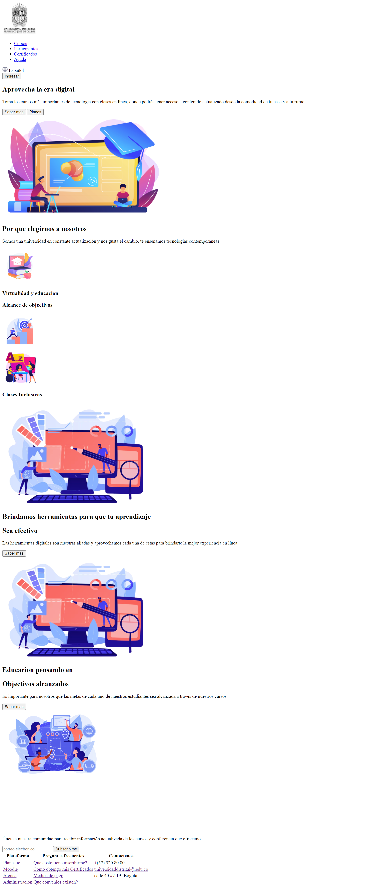

<h1>Taller Oscar<h1>

<h2>Informacion</h2>

Curso : Full Stack Basico - Grupo 1

Profesor : Cristian Patiño

<h2>Punto 1 : link de figma</h2>
<a href="https://www.figma.com/file/s3FElAnPs9jd5wfA9482JX/Oscar-Murillo-figma?type=design&node-id=0-1&t=dDdoKrgziP2ICJjs-0"
targe="_blank">Link de figma</a>

 
<a href="https://oscquitar.github.io/taller-9-full-stack/">Link pagina</a>

<h2>Punto 2 : HTML</h2>

<h2>Punto 3 : CSS</h2>

<h2>Punto 4 : CSS</h2>

<h2>punto 5 : CSS</h2>
